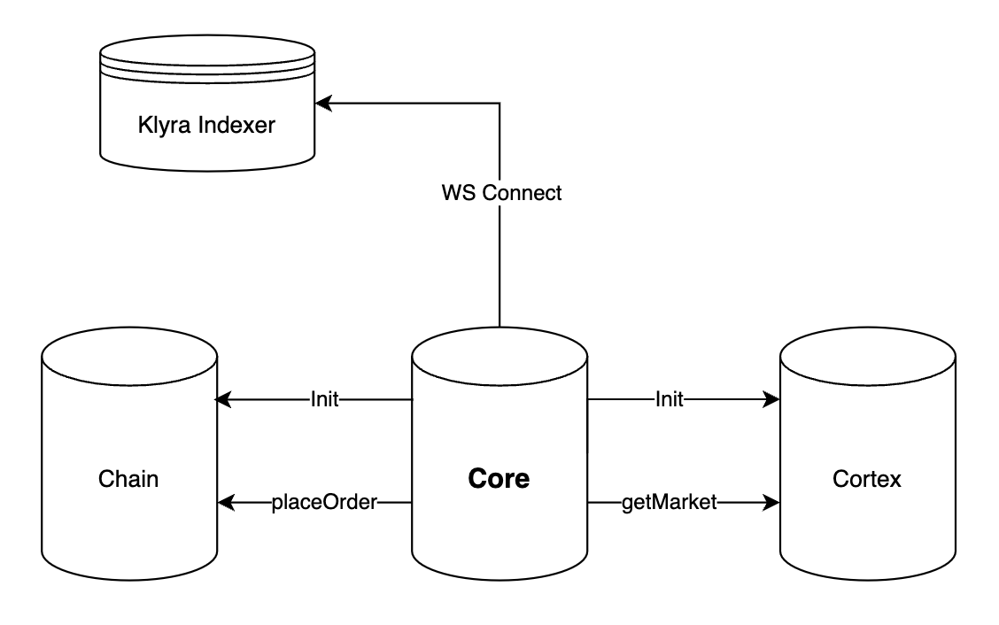
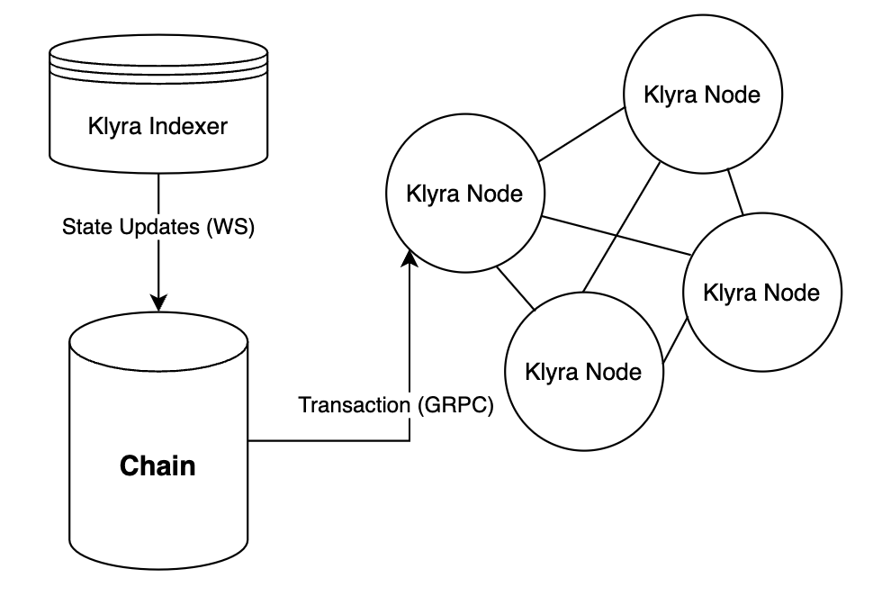
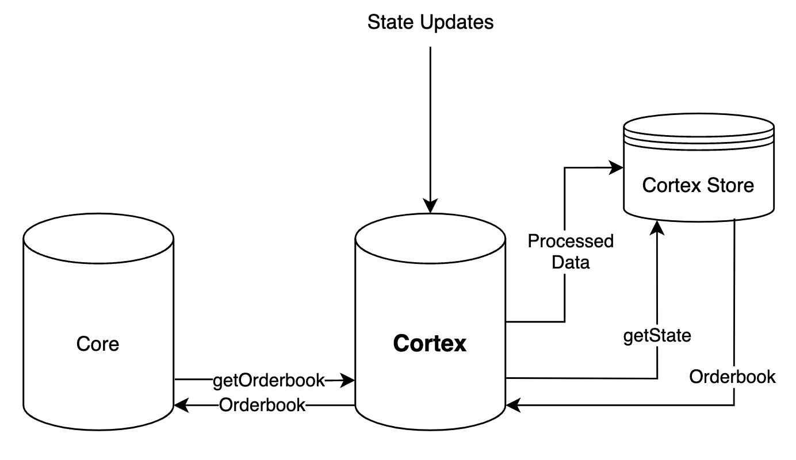

# Structure

The KlyraSDK is composed of 3 core components:

- **Core**: Wraps all other components and is what your project will import
- **Chain**: Interacts with all blockchain infrastructre which includes the indexer and nodes
- **Cortex**: Manages and processes all Klyra state

## Core

Core fuses all parts of the sdk into a single component. Core can be thought of as the entry
point for the KlyraSDK. It manages the initilization of both **Chain** and **Cortex**. Additionally, 
upon initialization of Core, websocket connections will be established with the indexer of Klyra
to be receive live updates from Klyra. When KlyraSDK methos are called, Core will delegate these
calls to the appropriate component. For example `placeOrder()` will delegate to **Chain** and 
delegate `getMarket()` to **Cortex**

## Chain

Chain is the blockchain client component of the KlyraSDK. It acts as the bi-directional
communication medium between the KlyraSDK and Klyra. Chain maintains connections to two 
pieces of klyra: the indexer and a few nodes. The indexer connection is established through 
websockets and the communication to the nodes occurs through GRPC. Transactions are sent 
through GRPC to the nodes while Klyra state updates are received through websocket from the 
indexer.

## Cortex

Cortex is the KlyraSDK state manager component. Upon the websocket connection established in **Core**, 
the KlyraSDK will begin receiving constant state updates from Klyra. This data reveived by the KlyraSDK
will be routed to the Cortex component where it will proccess this data into its proper types and
save it in it's store for it to be queried through KlyraSDK methods like `getOrderbook()`

