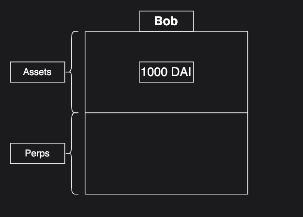
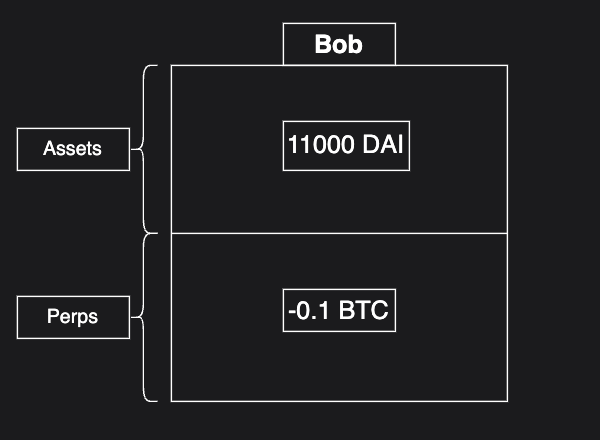
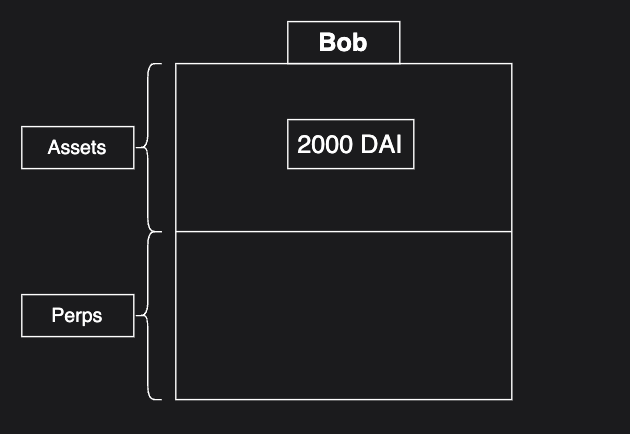

# Accounting

## Introductory
A core piece of Klyra’s infrastructure is keeping track of which accounts hold what positions. For Klyra’s initial financial primitive–perpetuals–an efficient accounting mechanism is used to track the net value of an account given all of its perpetual positions whether the trader is long or short or both across different perpetual markets.

## Advanced

### Long Perp Scheme
Klyra’s account structure can best be thought of as containing two sections: assets and perps.

When a user deposits on Klyra, the amount they deposit will be included in the assets section of their accounting structure. Let’s say Alice deposits 1,000 DAI.

Her account has now been credited with 1000 DAI. Alice really wants to go long BTC, so she opens a 10x leverage long BTC perp position where 1 BTC = 100,000 DAI

Here is the first instance of our accounting system. When a user goes long, the DAI value of their position at opening is subtracted from their “assets” section, and the amount they went long (i.e., 0.1 BTC) is added to their “perps” section. One core thing you will notice is the total value of the account structure has not changed: 0.1 BTC = 10,000 DAI so `0.1 BTC + ( -9,000 DAI ) = 1,000 DAI`. 

Now, suppose the price of BTC increases by 10%. So, we now have 1 BTC = 110,000 DAI and Alice becomes very happy. Let’s take a look at the accounting structure after this price change.

Nothing changed! The efficient outcome about this accounting scheme is no changes need to be made when the price changes. If we now take the net balance of the account after the price movement we have: 1 BTC = 110,000 DAI, so `0.1 BTC + ( -9,000 DAI ) = 2,000 DAI`. As shown Alice’s trading profits are reflected in our accounting scheme without needing to change anything. Alice can go and close her position leaving her account with 2,000 DAI.

Notice how we only have to make changes to the accounting structure when Alice takes an action like placing or closing a position.

### Short Perp Scheme
Klyra uses a similar accounting structure for tracking short positions, but in reverse. Let’s use the same example. This time, however, we have Bob who thinks the price of BTC will go down. He consequently decides to short BTC with 10x leverage. He has 1,000 DAI initial capital and 1 BTC = 10,000 DAI. First, like Alice, Bob needs to deposit his DAI into Klyra.

Great! Now Bob has his 1,000 DAI and he’s ready to short BTC with 10x leverage. He opens his short when 1 BTC = 10,000 DAI. This time, the accounting reflects the opposite of what happened when Alice went long. Bob gets credited 10,000 DAI and -0.1 BTC gets placed in his accounting structure. As we can see the net value of Bob’s account is still 1,000 DAI.

Now, unlike the Alice example, let’s assume the BTC price moves down 10% resulting in 1 BTC = 9,000 DAI. Bob’s net value becomes `11,000 DAI + ( -0.1 BTC )`, which totals out to 2,000 DAI.  

### Subaccounts
One detail abstracted away in the above examples is Klyra’s concept of subaccounts. On a chain level, a private/public key pair is associated with an account, but all accounts can have up to 128,000 subaccounts. The assets and perps are tracked on a per subaccount basis. The squares in the above examples actually represent a single subaccount of Alice and Bob respectively! 

Subaccounts are useful to traders for many reasons with the main one being risk management. Because each subaccount has its own collateral and perp positions, risk can be evaluated on a per-subaccount basis. For example, say Alice has  a small and stable 3x BTC long in subaccount 1. Alice then becomes bullish on a longtail memecoin that she also wants to long. However she doesn’t want her memecoin long to affect the health of her BTC position if it doesn’t go well. Alice can transfer some collateral into subaccount 2 and open the memecoin long on subaccount 2. If the trade goes poorly, it’s possible her subaccount 2 gets liquidated, but her BTC long position remains unaffected. 
