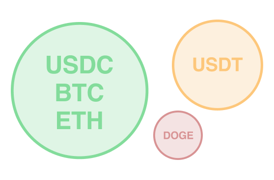

# Collateral

## Introductory
Collateral (or margin) is the capital a trader deposits to support their positions on Klyra. It ensures that traders who incur losses have enough funds to cover their counterparty's profits. Collateral maintains the integrity of the trading system by ensuring that both parties in a trade can fulfill their obligations, aligning risk with the size of the position and preventing scenarios where a trader's losses exceed her available funds.

A natural question arises: What type of collateral should a perpetual support? 

Consider a scenario where two traders wish to trade using different collateral types, and each refuses to accept the other's collateral. In this case, they cannot trade with each other because there would be no way to settle profits and losses between them. While traders could theoretically trade with different collateral types if they were willing to accept each other's assets, this is generally unrealistic. For example, a trader might only trust USDC and BTC and not want to trade with someone using Solana. Nevertheless, Klyra aims to create a platform where users can trade using their preferred collateral, even if it's Solana.

To enable trading with different collateral types, Klyra implements separate collateral pools to back trades, ensuring safety for both the platform and its users. Each pool holds specific types of collateral, such as USDC or Solana, and operates independently to prevent issues in one pool from affecting others. For example, if Solana's value drops significantly, it won't affect traders in the USDC pool.

Some pools support multiple collateral types (like USDC and BTC together), allowing traders to use different assets within the same pool. Additionally, certain pools can generate yield, enabling traders to earn returns while maintaining their positions. When opening a perpetual position, users select which pool they want to use. To ensure transparency and trust, all pool configurations are publicly available and verifiable, allowing traders to make informed decisions.

## Advanced
Klyra is built on a system of independent collateral pools, where each pool operates independently to minimize risk and ensure stability - for example, each pool has a separate [insurance fund](./liquidations.md#advanced). These pools can hold specific collateral types, such as USDC or USDT, or even a mix of assets like USDC and BTC. The isolation of pools ensures that disruptive events, such as a rapid price decrease of Solana or a USDT depeg, do not impact traders in other pools, for example traders using USDC pool. This separation allows governance to define tailored risk and reward parameters for each pool, catering to both conservative and esoteric markets. Additionally, some collateral pools can generate yield, providing traders with passive income opportunities while maintaining positions. This flexible and secure approach makes Klyra adaptable to various trading needs while safeguarding users' funds.

In Klyra, perpetual markets are tied directly to their collateral pools, meaning each perpetual exists uniquely within its pool. For example, if there are two separate pools—one holding USDC and the other holding USDT—and both offer BTC perpetual markets, traders in the USDC pool cannot trade with traders in the USDT pool. This separation exists to isolate risk, ensuring that issues in one pool do not affect others. This design is intuitive since profits, losses, and funding payments must be settled using the collateral within a specific pool, making it impossible for traders in separate pools to settle obligations with each other.

When opening a position, users specify the collateral pool they want to use, providing a guarantee that their exposure is limited to that pool's assets. This ensures safety and predictability for traders, as they are not affected by risks in other pools. However, this structure can lead to liquidity fragmentation, where smaller or more esoteric pools may have fewer participants and lower liquidity compared to larger pools, as they can only trade with others using the same collateral. To address this, Klyra's primary collateral pool will initially include USDC, BTC, and ETH, as these assets satisfy a wide range of needs while ensuring strong liquidity and maintaining security through their stability and reliability.

Changes to a pool's structure, such as adding or removing collateral types, can only be made through a governance vote. This process ensures that any changes are gradual and transparent, giving traders time to adjust their strategies accordingly. While new and experimental pools can be introduced, they may cater to niche markets with inherently lower liquidity than the primary pools. This design allows Klyra to support diverse trading needs while maintaining clear boundaries for risk management.

Multi-collateral pools are not yet available but are under development. 
