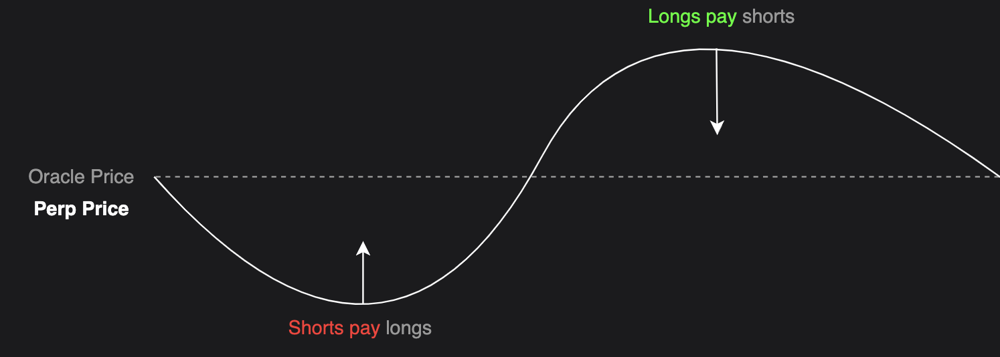

# Funding Rates

## Introductory
Funding rates help keep the price of a perpetual contract in line with the price of the actual asset it represents. They work by making small payments between traders depending on whether the perpetual price is higher or lower than the real asset price. When the perpetual price deviates from the underlying asset's price, traders are incentivized to act because they can profit from the difference. If the price is too high, selling the perpetual while buying the underlying asset locks in a profit as the prices converge. If the price is too low, buying the perpetual and selling the underlying asset achieves the same. These arbitrage opportunities naturally drive the perpetual price back in line with the underlying asset. This system adjusts continuously based on how far the prices are apart, ensuring they stay closely aligned. On Klyra, this adjustment happens every hour.

## Advanced
Funding rates are a critical mechanism in perpetual markets, designed to ensure that the contract price remains closely aligned with the price of the underlying asset. They achieve this by creating periodic cash flows between traders, incentivizing behavior that corrects price discrepancies. When the perpetual price is above the underlying asset price, funding rates make it more costly to maintain positions that push the price higher, encouraging traders to take actions that bring it back down. Conversely, when the perpetual price is below the asset price, funding rewards incentivize behavior that moves the price upward.

The funding rate consists of two components: the premium (which takes into account the current market price of the perpetual and is derived separately for each market) and the interest rate. On Klyra, the premium is calculated through a multi-step process. Every second, a validator samples the premium based on the relationship between the perpetual price and the underlying asset price. These second-by-second samples are then aggregated into minute averages, and every hour, the averages from the past 60 minutes are further aggregated into a final premium value. The funding rate, combining this premium with the interest rate, is settled hourly, ensuring that price corrections are timely and responsive to market conditions. The hourly settlement of funding rates strikes an effective balance. Settling too infrequently risks allowing prices to deviate significantly from the underlying, while hourly intervals ensure timely corrections. Hourly funding is also practical because the costs of opening and closing positions typically exceed the funding fees accrued within an hour, making it difficult to game the system. Additionally, settling every hour keeps computational costs manageable while maintaining responsiveness.

Every second, the premium is sampled as follows:

`Premium = (Max(0, Impact Bid Price - Index Price) - Max(0, Index Price - Impact Ask Price)) / Index Price`

With the following definitions:
- Impact Bid Price: Average execution price for a market sell of the impact notional value
- Impact Ask Price: Average execution price for a market buy of the impact notional value
- Impact Notional Amount: USD 500 / Market initial margin. This is set in the liquidity tier configuration for that market. The BTC-USD market, for example, has an impact notional of USD 10,000.

The premium formula simplifies to the following:

`If Impact Bid Price <= Index Price <= Impact Ask Price, the premium is 0`    

`If Index Price < Impact Bid Price: Premium = Impact Bid Price / Index Price - 1`

`If Impact Ask Price < Index Price: Premium = Impact Ask Price / Index Price - 1`

The second component of the funding rate is the fixed interest rate, which accounts for the cost of capital involved in executing carry trades. These trades, typically performed by sophisticated traders, help realign the price of the perpetual with the underlying asset when they diverge. Providing sufficient incentives for these trades is crucial; without them, the perpetual price may not track the spot price closely. Carry trades often require borrowing funds from other platforms, and the interest rate component subsidizes this borrowing cost. Intuitively, when the perpetual price matches the underlying price, running a carry trade should break even. However, the moment prices diverge, executing a carry trade aligned with the funding rate becomes profitable, incentivizing traders to restore price equilibrium. Given that the interest rate is designed to subsidize borrowing, it typically ranges between 8-12%. As a result, even when the perpetual price matches the underlying price, the funding rate remains non-zero, equal to the interest rate.

The interest rate is set for each market, according to the following formula:

`Interest Rate = (Interest Quote Index - Interest Base Index) / Funding Interval`

With the following definitions:
- Quote Base Index: The Interest Rate for Borrowing the Quote Currency (e.g., USDC in a BTC-USD market)
- Interest Base Index: The Interest Rate for Borrowing the Base Currency (e.g., BTC in a BTC-USD market)
- Funding Interval: 24 hours / time that funding occurs. In our case, this is 3 (since we calculate the funding interval for 8 hour periods, while subdividing it into 1 hour periods in the final calculation).

Once we have calculated the premium and the interest rate, the funding rate is calculated as follows:

`Funding Rate = (Premium Component + Interest Rate Component) * Time Since Last Funding / 8 hours` 

Since the Time Since Last Funding will typically be roughly 1 hour, the final calculation for the funding rate looks as follows:

`Funding Rate = (Premium Component + Interest Rate Component) / 8`

In order to protect traders, there is a maximum cap on the 8-hour funding rate. The particular cap depends on the market and is calculated as follows:

`8-hour Funding Rate Cap = 600% * (Initial Margin - Maintenance Margin Requirement)`

For example, if the Initial Margin is 6% and the Maintenance Margin Requirement is 3%, then the 8-hour Funding Rate Cap is 18%.
