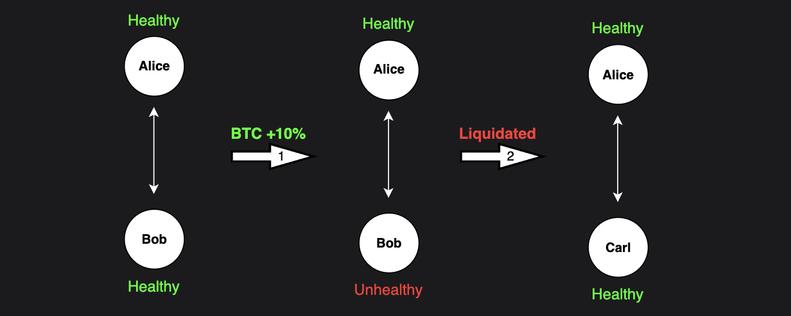

# Liquidations

## Introductory
Liquidations are a safety mechanism that Klyra uses to ensure no trader's account goes negative. As stated in the [overview](../overview.md), one trader's loss is another trader's gain. Therefore, if one account becomes negative, another trader has profit that Klyra cannot pay out. In finance, this is called an insolvent platform, and it's the worst thing that can happen to a financial platform.

For every trade a trader opens, another trader takes the opposite side. For example, if Alice goes long 1 BTC, then Bob (or some other trader) is short 1 BTC. Let's say the price of BTC rises, and Bob begins to lose a lot of money, up until the point where his losses are equal to his [collateral](./collateral-pools.md), i.e., his account value is zero. At this point, the simplest thing Klyra could do is force-close the position for both Alice and Bob. Now Klyra can be sure that an account cannot go negative in value because it force-closes all its positions.

This works, but it's an awful user experience for Alice. Imagine she wanted to continue holding her 1 BTC long. Why should she be forced to close her position because Bob lost money? To combat this, Klyra doesn't force-close the position for both sides; instead, it finds a new trader (who also wants to short BTC) to take the other side of Alice's position. Now Bob's side of the position is force-closed, but Alice's position remains open with a new trader.

However, this process of finding a new trader takes time, so it cannot start as soon as the trader's account value hits zero. Finding a new trader takes time, so this process cannot wait until an account value hits zero. If Klyra waited that long, the account could become negative before a new trader is found. To prevent this, Klyra initiates what's called a **liquidation** before the account reaches zero. This early start provides the necessary buffer time to find a new trader while ensuring the account stays positive.

In essence, liquidations serve as a safety net for Klyra, ensuring that no single bad trade can jeopardize the system's stability.

## Advanced
On Klyra, liquidations are the forced closure of a trader's position on the orderbook. This occurs when the trader's account balance—including collateral and unrealized profits or losses—falls below the maintenance margin requirement. During liquidation, the system matches the trader's position with counter-orders on the market, effectively selling or buying the position to bring the account back into compliance or close it entirely. If liquidity is insufficient or the clearing price results in a negative balance, additional mechanisms, such as insurance funds or deleveraging, are employed to manage risks.

### Maintenance Margin and Liquidation Conditions
A perpetual maintenance margin is the minimum collateral a trader must maintain to keep a position open. The maintenance margin for one position is calculated as:

`maintenance_margin = abs(position_value * maintenance_margin_rate)`

Where:

`position_value = position_size * network_price`

We see that the maintenance margin depends on both the position size (leverage), the [network price](./oracle.md), and the maintenance margin rate. This rate, typically between 1-10%, varies depending on platform-specific risk parameters. An account is deemed liquidatable when its value (including profits and losses) falls below the maintenance margin requirement.

Each block, the system identifies all accounts with liquidatable positions. However, due to the cap on transactions per block, not all positions can be liquidated at once. To address this limitation, the system employs a priority mechanism that determines which accounts are liquidated first, based on their risk level.

#### Liquidation Priority Metric
The priority for liquidation is calculated using the following metric:

`Priority=account_health / weighted_size`

Where:

`Account Health=total_net_collateral / maintenance_margin`

`Weighted Size=Sum( abs(position_size_i) * danger_index_i )`

Here, `i` represents each perpetual contract in the account's portfolio, and the `danger_index` is a market-specific parameter that reflects the relative risk of each contract. The system sorts accounts by this metric to ensure those with the highest risk are liquidated first.

### Liquidation Process
Once an account is selected for liquidation, the system identifies the specific position (perpetual contract) that, when liquidated, will most improve the account's health. If liquidating a single position doesn't restore the account above the maintenance margin, the account is re-evaluated and re-inserted into the liquidation queue with an updated priority for further processing.

### Safety Mechanisms: Insurance Fund and Deleveraging
To maintain system stability during periods of low market liquidity:
- Liquidation Prioritization: Liquidations are prioritized over standard orderbook transactions to ensure unhealthy accounts are addressed promptly.
- Insurance Fund: If a liquidation results in a negative balance due to low liquidity, the Klyra chain's insurance fund covers the shortfall. The insurance fund receives a portion of Klyra's fees and ensures the solvency of the system in case of failures. The insurance fund is permissionless and programmed into the chain—it is not run by the Klyra team or any central entity.
- Deleveraging: In rare cases where liquidation cannot be completed successfully, a deleveraging mechanism is triggered. This mechanism forcefully closes the unhealthy account by offsetting its positions against randomly selected accounts with opposing positions. Deleveraging is a last resort and is designed to be an extremely rare occurrence. When triggered, the system halts the opening of new positions to protect the ecosystem and traders.

### Liquidation Price
When liquidating an account’s perp position, a minimum price must be determined to place the order on the orderbook. This is the worst price at which the order can be executed. To determine the liquidation price, Klyra uses the most aggressive price between the fillable price and the bankruptcy price. The fillable price varies depending on the health of the account; the worse the health, the higher the delta between the oracle price and the fillable price. The bankruptcy price is the price at which if the liquidation is matched will result in an account balance of zero (i.e all collateral is wiped out). This means that when the account is barely liquidatable Klyra will use the bankruptcy price to maximize the chance that the account gets liquidated (this is a safety mechanism). When the account is very close to bankruptcy Klyra will use the fillable price to allow for more potential orders that can match with the insurance fund covering. This is designed to maximize the likelihood of a successful liquidation. Below is the formula used to calculate each of these respective prices.

#### Fillable Price
`fillable price = (PNNV - ABR * SMMR * PMMR) / PS`

- PNNV is the position net notional value

- ABR (adjusted bankruptcy rate) is BA * (1 - (TNC / TMMR))

- BA: bankruptcy adjustment in parts per million (this is a constant set in the configuration of the chain that can be changed by a governance vote)

- SMMR: spread to maintenance margin ratio (this is a constant set in the configuration of the chain that can be changed by a governance vote)

- PMMR: position maintenance margin requirement

To intuitively understand the formula for the fillable price, we can simplify the formula and set constants to default values, to get the following:

`fillable price = Network Price * (TNC / TMMR)`

As mentioned above, liquidations are triggered when `TNC = TMMR`, so at that point the fillable price will be the oracle price - ie. we try to close the unhealthy positions at the current price (with no discount). If the price continues to move against the trader, and their TNC continues to drop, `TNC / TMMR` becomes less than 1 which means we start trying to sell the position at a discount, effectively providing additional incentive for someone to buy the position.

#### Bankruptcy Price
`bankruptcy price = (-DNNV - (TNC * (abs(DMMR) / TMMR))) / PS`

- DNNV (delta position net notional value) is PNNVAD - PNNV.

- PNNV is the position net notional value.

- PNNVAD is the position net notional value after delta. 

- Net notional value refers to the value of the position in the quote currency (typically USD). 

- TNC: total net collateral. The total value of a subaccount including all positions and obligations (typicall in USD).

- DMMR (delta maintenance margin requirement) =  PMMRAD - PMMR 
where PMMRAD is the position margin requirement after delta. This value measures how much the maintenance margin changes due to the liquidation order being matched.

- TMMR: total maintenance margin requirement of the current open position. 

- PS: position size in the base currency (e.g., DOGE, not USD).

- Delta: refers to the change in position size due to the liquidation order being matched.

Unfortunately, the formula for the bankruptcy price cannot be simplified into an intuitive formula like the fillable price. However, the idea remains intuitive, if a user were to close all their positions at the bankruptcy price (for each position), their account would be worth 0. This can be thought of as the breakeven price, if a perpetual is closed below the bankruptcy price, the insurance fund will need to intervene.
