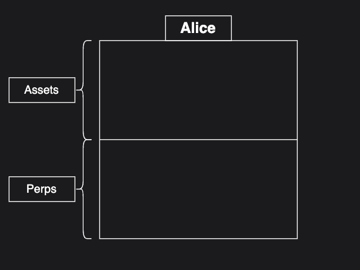
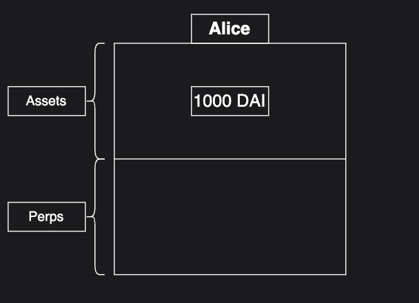
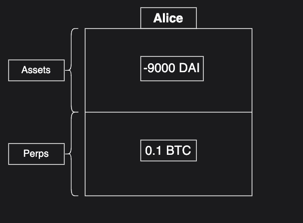
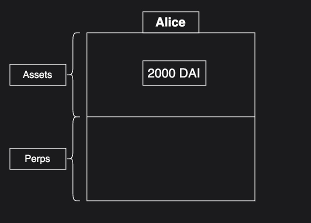
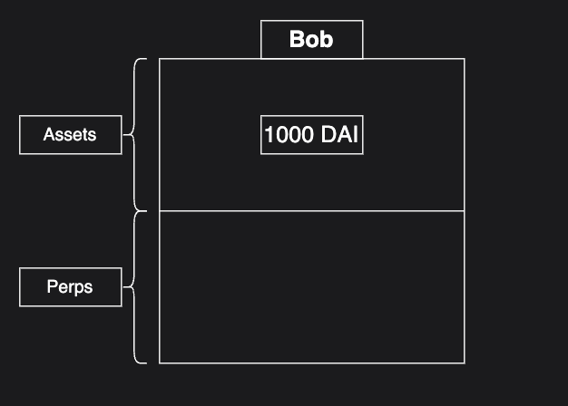
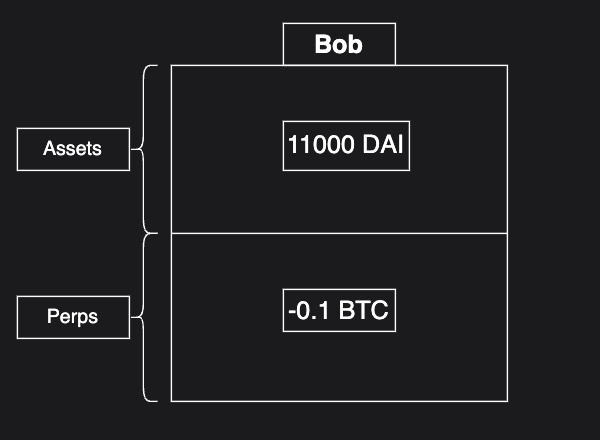
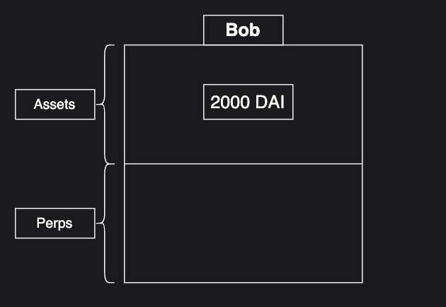

# Contabilidad

## Introducción
Una pieza central de la infraestructura de Klyra es llevar un registro de qué cuentas tienen qué posiciones. Para el primer producto financiero de Klyra, perpetuals, se utiliza un mecanismo de contabilidad eficiente que rastrea el valor neto de una cuenta considerando todas sus posiciones perpetuals, ya sea que el trader esté en largo, corto o ambas posiciones en diferentes mercados perpetuals.

## Avanzada

### El Esquema (largo perpetual)
La estructura de cuentas de Klyra se puede entender mejor como compuesta por dos secciones: activos y perpetuals.

Cuando un usuario deposita en Klyra, la cantidad depositada se incluye en la sección de activos de su estructura contable. Supongamos que Alice deposita 1,000 DAI.

Su cuenta ahora ha sido acreditada con 1,000 DAI. Alice quiere abrir una posición larga de BTC con un apalancamiento de 10x, donde 1 BTC = 100,000 DAI.

Aquí es donde aparece nuestro sistema de contabilidad por primera vez. Cuando un usuario abre una posición larga, el valor en DAI de su posición al abrirse se resta de su sección de "activos", y la cantidad de BTC que compró (es decir, 0.1 BTC) se añade a su sección de "perpetuals". Un punto clave es que el valor total de la estructura de la cuenta no ha cambiado: 0.1 BTC = 10,000 DAI, por lo que `0.1 BTC + (-9,000 DAI) = 1,000 DAI`.

Ahora, supongamos que el precio del BTC aumenta un 10%. Es decir, ahora 1 BTC = 110,000 DAI Veamos cómo queda la estructura contable después de este cambio de precio.

¡Nada ha cambiado! Lo eficiente de este esquema de contabilidad es que no se necesitan realizar cambios cuando cambia el precio. Si tomamos el balance neto de la cuenta después del movimiento de precio tenemos: 1 BTC = 110,000 DAI, por lo que `0.1 BTC + (-9,000 DAI) = 2,000 DAI`. Como se muestra, las ganancias de Alice se reflejan en nuestro esquema contable sin necesidad de modificar nada. Alice puede cerrar su posición, dejando su cuenta con 2,000 DAI.

Observe cómo solo necesitamos realizar cambios en la estructura contable cuando Alice realiza una acción, como abrir o cerrar una posición.

### El Esquema (corto perpetual)
Klyra utiliza una estructura contable similar para rastrear posiciones cortas, pero de manera inversa. Utilicemos el mismo ejemplo, pero esta vez con Bob, quien cree que el precio de BTC disminuirá. Por lo tanto, decide abrir una posición corta de BTC con un apalancamiento de 10x. Tiene un capital inicial de 1,000 DAI y 1 BTC = 10,000 DAI. Primero, como Alice, Bob necesita depositar sus DAI en Klyra.

¡Genial! Ahora Bob tiene sus 1,000 DAI y está listo para abrir una posición corta de BTC con un apalancamiento de 10x. Abre su posición corta cuando 1 BTC = 10,000 DAI. Esta vez, la contabilidad refleja lo opuesto a lo que sucedió cuando Alice abrió una posición larga. A Bob se le acredita 10,000 DAI y se le registra -0.1 BTC en su estructura contable. Como podemos ver, el valor neto de la cuenta de Bob sigue siendo 1,000 DAI.

Ahora, a diferencia del ejemplo de Alice, supongamos que el precio del BTC disminuye un 10%, lo que resulta en 1 BTC = 9,000 DAI. El valor neto de Bob se convierte en `11,000 DAI + (-0.1 BTC)`, lo que da un total de 2,000 DAI.

### Subcuentas
Un detalle que se omite en los ejemplos anteriores es el concepto de subcuentas de Klyra. A nivel de blockchain, un par de clave privada/pública está asociado a una cuenta, pero todas las cuentas pueden tener hasta 128,000 subcuentas. Los activos y los perpetuals se rastrean por subcuenta. Los cuadros en los ejemplos anteriores representan una sola subcuenta de Alice y Bob, respectivamente.

Las subcuentas son útiles para los traders por muchas razones, siendo la principal la gestión de riesgos. Dado que cada subcuenta tiene su propio colateral y posiciones perpetuas, el riesgo se puede evaluar por subcuenta. Por ejemplo, supongamos que Alice tiene una posición larga de BTC pequeña y estable con apalancamiento de 3x en la subcuenta 1. Alice luego se vuelve optimista sobre una memecoin y quiere abrir una posición larga. Sin embargo, no quiere que esta posición afecte la salud de su posición de BTC si las cosas no salen bien. Alice puede transferir algo de colateral a la subcuenta 2 y abrir la posición larga de memecoin allí. Si la operación va mal, es posible que su subcuenta 2 sea liquidada, pero su posición larga de BTC permanecerá intacta.
