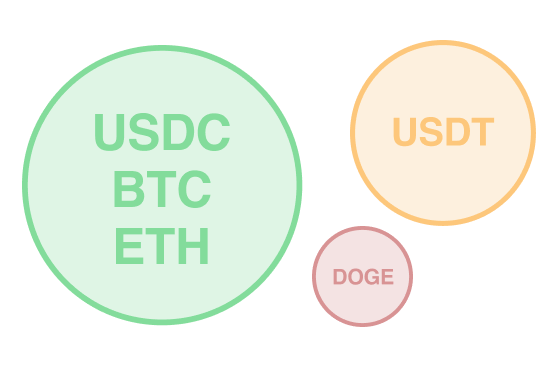

# Collateral

## Introducción
El colateral (o margen) es el capital que un trader deposita para respaldar sus posiciones en Klyra. Asegura que los traders que incurren en pérdidas tengan fondos suficientes para cubrir las ganancias de su contraparte. El colateral mantiene la integridad del sistema de trading al asegurar que ambas partes en una operación puedan cumplir con sus obligaciones, alineando el riesgo con el tamaño de la posición y previniendo escenarios donde las pérdidas de un trader excedan sus fondos disponibles.

Surge una pregunta natural: ¿Qué tipo de colateral debería soportar un perpetual?

Consideremos un escenario donde dos traders desean operar usando diferentes tipos de colateral, y cada uno se niega a aceptar el colateral del otro. En este caso, no pueden operar entre sí porque no habría forma de liquidar las ganancias y pérdidas entre ellos. Si bien los traders podrían teóricamente operar con diferentes tipos de colateral si estuvieran dispuestos a aceptar los activos del otro, esto generalmente no es realista. Por ejemplo, un trader podría confiar solo en USDC y BTC y no querer operar con alguien que use Dogecoin. Sin embargo, Klyra aspira a crear una plataforma donde los usuarios puedan operar usando su colateral preferido, incluso si es Dogecoin.

Para permitir el trading con diferentes tipos de colateral, Klyra implementa pools de colateral separados para respaldar las operaciones, garantizando la seguridad tanto para la plataforma como para sus usuarios. Cada pool mantiene tipos específicos de colateral, como USDC o Dogecoin, y opera de manera independiente para evitar que los problemas en un pool afecten a otros. Por ejemplo, si el valor de Dogecoin cae significativamente, no afectará a los traders en el pool de USDC.

Algunos pools admiten múltiples tipos de colateral (como USDC y BTC juntos), permitiendo a los traders usar diferentes activos dentro del mismo pool. Además, ciertos pools pueden generar rendimiento, permitiendo a los traders ganar retornos mientras mantienen sus posiciones. Al abrir una posición perpetual, los usuarios seleccionan qué pool quieren usar. Para garantizar la transparencia y la confianza, todas las configuraciones de los pools están disponibles públicamente y son verificables, permitiendo a los traders tomar decisiones informadas.

## Avanzado
Klyra está construida sobre un sistema de pools de colateral independientes, donde cada pool opera de manera autónoma para minimizar el riesgo y garantizar la estabilidad - por ejemplo, cada pool tiene un [fondo de seguro](./liquidations.md#advanced) separado. Estos pools pueden mantener tipos específicos de colateral, como USDC o USDT, o incluso una mezcla de activos como USDC y BTC. El aislamiento de los pools asegura que eventos disruptivos, como una caída rápida del precio de Dogecoin o un desanclaje de USDT, no afecten a los traders en otros pools, por ejemplo, a los traders que usan el pool de USDC. Esta separación permite que la gobernanza defina parámetros de riesgo y recompensa personalizados para cada pool, atendiendo tanto a mercados conservadores como esotéricos. Además, algunos pools de colateral pueden generar rendimiento, proporcionando a los traders oportunidades de ingresos pasivos mientras mantienen sus posiciones. Este enfoque flexible y seguro hace que Klyra sea adaptable a diversas necesidades de trading mientras salvaguarda los fondos de los usuarios.

En Klyra, los mercados perpetuals están vinculados directamente a sus pools de colateral, lo que significa que cada perpetuals existe de manera única dentro de su pool. Por ejemplo, si hay dos pools separados—uno que mantiene USDC y otro que mantiene USDT—y ambos ofrecen mercados perpetuals de BTC, los traders en el pool de USDC no pueden operar con traders en el pool de USDT. Esta separación existe para aislar el riesgo, asegurando que los problemas en un pool no afecten a otros. Este diseño es intuitivo ya que las ganancias, pérdidas y pagos de financiamiento deben liquidarse usando el colateral dentro de un pool específico, haciendo imposible que los traders en pools separados liquiden obligaciones entre sí.

Al abrir una posición, los usuarios especifican el pool de colateral que desean usar, proporcionando una garantía de que su exposición está limitada a los activos de ese pool. Esto garantiza seguridad y previsibilidad para los traders, ya que no se ven afectados por los riesgos en otros pools. Sin embargo, esta estructura puede llevar a una fragmentación de la liquidez, donde los pools más pequeños o esotéricos pueden tener menos participantes y menor liquidez en comparación con los pools más grandes, ya que solo pueden operar con otros que usen el mismo colateral. Para abordar esto, el pool de colateral principal de Klyra incluirá inicialmente USDC, BTC y ETH, ya que estos activos satisfacen una amplia gama de necesidades mientras aseguran una fuerte liquidez y mantienen la seguridad a través de su estabilidad y confiabilidad.

Los cambios en la estructura de un pool, como agregar o eliminar tipos de colateral, solo pueden realizarse a través de un voto de gobernanza. Este proceso asegura que cualquier cambio sea gradual y transparente, dando tiempo a los traders para ajustar sus estrategias en consecuencia. Si bien se pueden introducir pools nuevos y experimentales, estos pueden atender a mercados nicho con una liquidez inherentemente menor que los pools principales. Este diseño permite que Klyra apoye diversas necesidades de trading mientras mantiene límites claros para la gestión de riesgos.

Los pools multi-colateral aún no están disponibles pero están en desarrollo.