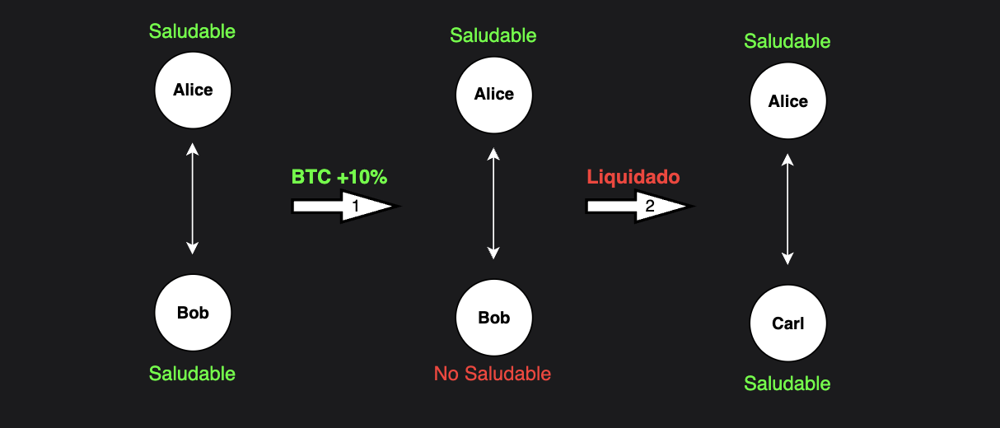

# Liquidaciones

## Introducción
Las liquidaciones son un mecanismo de seguridad que Klyra utiliza para asegurar que ninguna cuenta de trader llegue a valores negativos. Como se menciona en la [descripción general](../overview.md), la pérdida de un trader es la ganancia de otro trader. Por lo tanto, si una cuenta se vuelve negativa, otro trader tiene ganancias que Klyra no puede pagar. En finanzas, esto se llama una plataforma insolvente, y es lo peor que puede suceder a una plataforma financiera.

Por cada operación que un trader abre, otro trader toma el lado opuesto. Por ejemplo, si Alice toma una posición larga de 1 BTC, entonces Bob (u otro trader) tiene una posición corta de 1 BTC. Digamos que el precio de BTC sube, y Bob comienza a perder mucho dinero, hasta el punto en que sus pérdidas son iguales a su [colateral](./collateral-pools.md), es decir, el valor de su cuenta es cero. En este punto, lo más simple que Klyra podría hacer es forzar el cierre de la posición tanto para Alice como para Bob. Ahora Klyra puede asegurarse de que ninguna cuenta puede tener un valor negativo porque fuerza el cierre de todas sus posiciones.

Esto funciona, pero es una experiencia de usuario terrible para Alice. Imagina que ella quería continuar manteniendo su posición larga de 1 BTC. ¿Por qué debería verse forzada a cerrar su posición porque Bob perdió dinero? Para combatir esto, Klyra no fuerza el cierre de la posición para ambas partes; en su lugar, encuentra un nuevo trader (que también quiere tomar una posición corta en BTC) para tomar el otro lado de la posición de Alice. Ahora el lado de la posición de Bob se cierra forzosamente, pero la posición de Alice permanece abierta con un nuevo trader.

Sin embargo, este proceso de encontrar un nuevo trader lleva tiempo, por lo que no puede comenzar tan pronto como el valor de la cuenta del trader llega a cero. Encontrar un nuevo trader toma tiempo, por lo que este proceso no puede esperar hasta que el valor de una cuenta llegue a cero. Si Klyra esperara tanto tiempo, la cuenta podría volverse negativa antes de encontrar un nuevo trader. Para prevenir esto, Klyra inicia lo que se llama una **liquidación** antes de que la cuenta llegue a cero. Este inicio temprano proporciona el tiempo buffer necesario para encontrar un nuevo trader mientras asegura que la cuenta se mantenga positiva.

En esencia, las liquidaciones sirven como una red de seguridad para Klyra, asegurando que ninguna operación mala pueda poner en peligro la estabilidad del sistema.

## Avanzado
En Klyra, las liquidaciones son el cierre forzado de la posición de un trader en el orderbook. Esto ocurre cuando el saldo de la cuenta del trader—incluyendo el colateral y las ganancias o pérdidas no realizadas—cae por debajo del requisito de margen de mantenimiento. Durante la liquidación, el sistema empareja la posición del trader con órdenes contrarias en el mercado, efectivamente vendiendo o comprando la posición para devolver la cuenta a un estado de cumplimiento o cerrarla por completo. Si la liquidez es insuficiente o el precio de liquidación resulta en un saldo negativo, se emplean mecanismos adicionales, como fondos de seguro o desapalancamiento, para gestionar los riesgos.

### Margen de Mantenimiento y Condiciones de Liquidación
El margen de mantenimiento perpetuo es el colateral mínimo que un trader debe mantener para mantener una posición abierta. El margen de mantenimiento para una posición se calcula como:

`margen_de_mantenimiento = abs(valor_de_posición * tasa_de_margen_de_mantenimiento)`

Donde:

`valor_de_posición = tamaño_de_posición * precio_de_red`

Vemos que el margen de mantenimiento depende tanto del tamaño de la posición (apalancamiento), el [precio de red](./oracle.md), y la tasa de margen de mantenimiento. Esta tasa, típicamente entre 1-10%, varía según los parámetros de riesgo específicos de la plataforma. Una cuenta se considera liquidable cuando su valor (incluyendo ganancias y pérdidas) cae por debajo del requisito de margen de mantenimiento.

En cada bloque, el sistema identifica todas las cuentas con posiciones liquidables. Sin embargo, debido al límite de transacciones por bloque, no todas las posiciones pueden ser liquidadas al mismo tiempo. Para abordar esta limitación, el sistema emplea un mecanismo de prioridad que determina qué cuentas se liquidan primero, basándose en su nivel de riesgo.

#### Métrica de Prioridad de Liquidación
La prioridad para la liquidación se calcula utilizando la siguiente métrica:

`Prioridad = salud_de_cuenta / tamaño_ponderado`

Donde:

`Salud de Cuenta = colateral_neto_total / margen_de_mantenimiento`

`Tamaño Ponderado = Suma( abs(tamaño_de_posición_i) * índice_de_peligro_i )`

Aquí, `i` representa cada contrato perpetuo en el portafolio de la cuenta, y el `índice_de_peligro` es un parámetro específico del mercado que refleja el riesgo relativo de cada contrato. El sistema ordena las cuentas por esta métrica para asegurar que aquellas con el mayor riesgo sean liquidadas primero.

### Proceso de Liquidación
Una vez que se selecciona una cuenta para liquidación, el sistema identifica la posición específica (contrato perpetuo) que, al ser liquidada, mejorará más la salud de la cuenta. Si la liquidación de una sola posición no restaura la cuenta por encima del margen de mantenimiento, la cuenta se reevalúa y se reinserta en la cola de liquidación con una prioridad actualizada para su posterior procesamiento.

### Mecanismos de Seguridad: Fondo de Seguro y Desapalancamiento
Para mantener la estabilidad del sistema durante períodos de baja liquidez del mercado:
- Priorización de Liquidaciones: Las liquidaciones tienen prioridad sobre las transacciones estándar del orderbook para asegurar que las cuentas insalubres sean atendidas rápidamente.
- Fondo de Seguro: Si una liquidación resulta en un saldo negativo debido a la baja liquidez, el fondo de seguro de la cadena Klyra cubre el déficit. El fondo de seguro recibe una porción de las comisiones de Klyra y asegura la solvencia del sistema en caso de fallos. El fondo de seguro es sin permisos y está programado en la cadena—no es administrado por el equipo de Klyra ni por ninguna entidad central.
- Desapalancamiento: En casos raros donde la liquidación no puede completarse exitosamente, se activa un mecanismo de desapalancamiento. Este mecanismo cierra forzosamente la cuenta insalubre compensando sus posiciones contra cuentas seleccionadas aleatoriamente con posiciones opuestas. El desapalancamiento es un último recurso y está diseñado para ser un evento extremadamente raro. Cuando se activa, el sistema detiene la apertura de nuevas posiciones para proteger el ecosistema y los traders.

### Precio de Liquidación
Al liquidar la posición perp de una cuenta, se debe determinar un precio mínimo para colocar la orden en el orderbook. Este es el peor precio al que se puede ejecutar la orden. Para determinar el precio de liquidación, Klyra utiliza el precio más agresivo entre el precio llenable y el precio de bancarrota. El precio llenable varía según la salud de la cuenta; cuanto peor sea la salud, mayor será la diferencia entre el precio del oráculo y el precio llenable. El precio de bancarrota es el precio al cual, si la liquidación se empareja, resultará en un saldo de cuenta de cero (es decir, todo el colateral se pierde). Esto significa que cuando la cuenta está apenas liquidable, Klyra utilizará el precio de bancarrota para maximizar la probabilidad de que la cuenta sea liquidada (este es un mecanismo de seguridad). Cuando la cuenta está muy cerca de la bancarrota, Klyra utilizará el precio llenable para permitir más órdenes potenciales que puedan emparejarse con la cobertura del fondo de seguro. Esto está diseñado para maximizar la probabilidad de una liquidación exitosa. A continuación se muestra la fórmula utilizada para calcular cada uno de estos precios respectivos.

#### Precio Llenable
`precio_llenable = (PNNV - ABR * SMMR * PMMR) / PS`

- PNNV es el valor nocional neto de la posición

- ABR (tasa de quiebra ajustada) es BA * (1 - (TNC / TMMR))

- BA: ajuste de quiebra en partes por millón (este es un valor constante establecido en la configuración de la cadena que puede cambiarse mediante una votación de gobernanza)

- SMMR: ratio de margen de mantenimiento (este es un valor constante establecido en la configuración de la cadena que puede cambiarse mediante una votación de gobernanza)

- PMMR: requisito de margen de mantenimiento de la posición

Para entender intuitivamente la fórmula del precio llenable, podemos simplificar la fórmula y establecer las constantes a valores predeterminados, obteniendo lo siguiente:

`precio_llenable = Precio_de_Red * (TNC / TMMR)`

Como se mencionó anteriormente, las liquidaciones se activan cuando `TNC = TMMR`, por lo que en ese punto el precio llenable será el precio del oráculo - es decir, intentamos cerrar las posiciones insalubres al precio actual (sin descuento). Si el precio continúa moviéndose en contra del trader, y su TNC continúa bajando, `TNC / TMMR` se vuelve menor que 1, lo que significa que comenzamos a intentar vender la posición con descuento, proporcionando efectivamente un incentivo adicional para que alguien compre la posición.

#### Precio de Quiebra
`precio_quiebra = (-DNNV - (TNC * (abs(DMMR) / TMMR))) / PS`

- DNNV (delta valor nocional neto de posición) es PNNVAD - PNNV

- PNNV es el valor nocional neto de la posición

- PNNVAD es el valor nocional neto de la posición después del delta.

- El valor nocional neto se refiere al valor de la posición en la moneda de cotización (normalmente USD).

- TNC: colateral neto total

- DMMR (delta requisito de margen de mantenimiento) = PMMRAD - PMMR donde PMMRAD es el requisito de margen de la posición después del delta.

- TMMR: requisito total de margen de mantenimiento de la posición abierta actual

- PS: tamaño de la posición

- Delta: se refiere al cambio en el tamaño de la posición debido a que se empareja la orden de liquidación.

Desafortunadamente, la fórmula del precio de quiebra no puede simplificarse en una fórmula intuitiva como la del precio llenable. Sin embargo, la idea sigue siendo intuitiva: si un usuario cerrara todas sus posiciones al precio de quiebra (para cada posición), su cuenta valdría 0. Esto puede considerarse como el precio de equilibrio; si un perpetual se cierra por debajo del precio de quiebra, el fondo de seguro necesitará intervenir.